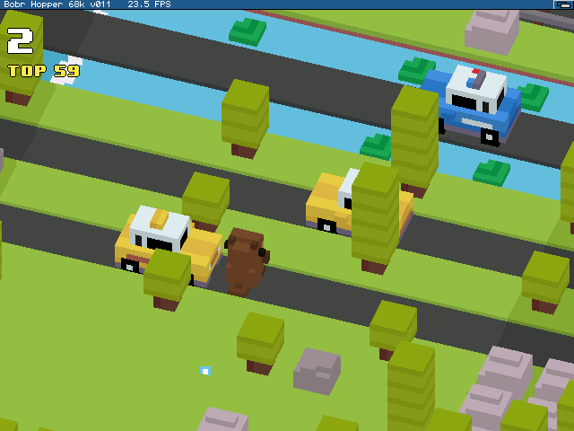

# Bobr Hopper — Amiga 68k

A native AmigaOS port of **Bobr Hopper**, a hopping game: cross the roads, the rivers and the railway without
being run over. **Classic** (endless) and **Progression** (levels with a finish line, a career and ranks),
English and Polish, a beaver or a chicken.

The game logic is shared, line for line, with the author's
[SF2000 / GB300](https://github.com/angree/sf2000-BobrHopper) and [R36S](https://github.com/angree/R36S-BobrHopper)
ports. What is new here is everything below it.



## How it draws — no 3D at all

Every object is rendered **once, offline**, through the game's own camera and saved as a sprite; the Amiga then
paints those sprites row by row, back to front. The substitution is exact rather than approximate because the
game's camera is **orthographic and never rotates**: an object's size on screen does not depend on where it is,
so one baked picture is correct everywhere.

- the hero is baked in 12 directions and 11 poses (hop squash and stretch, run over, hit from the side)
- cars, logs, trees and rocks in 4 directions; logs are cut at the water line in the renderer, not in the picture
- two complete sets: **320x240** (1.6 MB) and **640x480** (6.4 MB) — the game loads only the one it needs

Everything is 16.16 fixed point: the target is a plain **68020 with no FPU**.

## Requirements

| | |
|---|---|
| CPU | 68020 or better, no FPU needed |
| display | AGA (320x240), or an RTG board — Picasso96 / CyberGraphX (320x240 or 640x480) |
| OS | Kickstart 3.0+ |
| memory | about 1 MB chip (AGA) and 6 MB fast RAM; **12 MB** fast for 640x480 |
| storage | a hard disk — the music is streamed while you play |

Recommended:

- 030/33 for 320x240 RTG
- 040/40 for 320x240 AGA or 640x480 RTG

## Installing and playing

Unpack the release archive anywhere and double-click **bobrhopper**. The game writes only inside its own drawer.

**BobrHopperPrefs** (run it before the game) chooses what the game opens:

| setting | values |
|---|---|
| Graphics | AGA or RTG |
| Resolution | 320x240 (both), 640x480 (RTG only) |
| Screen bar | the Workbench title bar above the game, on or off |

It also works from a Shell: `BobrHopperPrefs GFX=RTG SCREEN=640x480 BAR=OFF` (`SHOW` prints the settings).
Everything else — sound and music volume, language, character — is on the game's own settings screen
(**S** on the title screen).

| | keyboard | joystick / CD32 pad |
|---|---|---|
| hop | cursor keys | stick — the hop happens when you let go |
| A (choose, play again) | A, Space, Return | fire |
| B (back) | B, Backspace | second button (in menus) |
| pause | P, Esc | second button during play, PLAY on a CD32 pad |
| settings (S) | S, Tab | green |
| back to the menu after a game | S | stick left |
| quit | Esc on the title screen, or Exit in the pause menu | |

## Building

Toolchain: [bebbo's amiga-gcc](https://github.com/bebbo/amiga-gcc) (GCC 6.5.0b) at `/opt/amiga/bin`, run under
WSL (Ubuntu 22.04). Flags that are not negotiable, each learned the hard way: `-mcpu=68020 -msoft-float -O1
-noixemul`, never strip the binary, never call `sprintf`, no C++ streams.

```sh
sh build/build_amiga.sh game      # the game, BobrHopperPrefs and the test runner
sh build/package_amiga.sh         # the release drawer and zip, named after src/amiga/version_bh.h
```

**CyberGraphX developer headers are not included** — they are not redistributable. Put `cybergraphx/`, `clib/`,
`inline/`, `libraries/` and `proto/` into `src/amiga/cgx-include/` before building.

The baked data is in `data_amiga/`, so building the game needs nothing else. To re-bake it you need the PC build
of the software renderer (`build/build_pc.sh`, zig + SDL2 — see `build/setup_tools.sh`):

```sh
out/pc/sw_bake_amiga.exe --data data_sf2000 --out out/check/amiga/sprites                                   # 320x240
out/pc/sw_bake_amiga.exe --data data_sf2000 --out out/check/amiga/sprites640 --view-scale 3 --canvas 2048 768  # 640x480
python tools/make_amiga_logo.py                        # then --width 344 --sprites out/check/amiga/sprites640
python tools/pack_amiga_sprites.py                     # then --in ...sprites640 --name sprites640.spr --seal 2
python tools/make_amiga_font.py --sizes 6,7,9,16       # and --data data --sizes 12,14,18,32 --name font640.bhf
python tools/make_amiga_icon.py
```

## Layout

```
src/game      the game itself, shared with the SF2000 and R36S ports
src/ui        the shared screens (menus, settings, career, ranks), compiled unchanged
src/amiga     everything Amiga: display (AGA c2p / RTG), Paula audio, streamed ADPCM music, sprite renderer,
              joystick, the settings file, and shim/ - the five drawing calls the shared screens need
apps          sw_bake_amiga.cpp - the offline sprite baker (and the PC tools it is built with)
tools         the data pipeline: sprites, logo, font, icon
build/amiga   BobrHopperPrefs and the test runner
winuae        the test machine: configs and the host-side harness
```

## Testing without a person at the keyboard

`winuae/harness/bh_go.ps1` drives a WinUAE machine that stays up: a runner inside the guest (`bhloop`) executes
whatever the host drops into `Work:go`, and the game leaves when it finds `Work:quit.req`. With `autoplay.txt` in
the game's drawer the game plays itself and saves screen dumps; `profile.txt` turns on the per-stage timing log.

## Credits and licence

MIT — see [LICENSE](LICENSE) and [NOTICE.md](NOTICE.md).

- Game logic ported from [EvanBacon/expo-crossy-road](https://github.com/EvanBacon/expo-crossy-road) (MIT).
- Chunky-to-planar routines by **Mikael Kalms** ([kalms-c2p](https://github.com/Kalmalyzer/kalms-c2p)).
- Every sound and music track was made for this port; no audio from the original project is included.

Not affiliated with, endorsed by, or connected to Hipster Whale, Yodo1, or the "Crossy Road" game or trademark.

---

## Po polsku

**Bóbr Hopper** na Amigę 68k: natywna wersja dla AmigaOS, bez 3D — każdy obiekt jest wcześniej wyrenderowany do
sprite'a, a Amiga rysuje je rząd po rzędzie. Działa na gołym 68020 bez FPU, na AGA (320×240) i na kartach RTG
(320×240 lub 640×480), ale zalecane jest minimum 030 dla trybu RTG i 040 dla AGA albo RTG 480p. Tryby Classic i Progression z karierą i rangami, polski i angielski interfejs.

Instalacja: rozpakuj archiwum w dowolnym miejscu i uruchom **bobrhopper**. Tryb grafiki (AGA/RTG), rozdzielczość
i pasek ekranu ustawia **BobrHopperPrefs**; resztę ustawień ma gra (klawisz **S** na ekranie tytułowym).
Sterowanie: strzałki lub joystick (skok przy puszczeniu), A/fire — wybór i kolejna gra, S/joystick w lewo — menu,
P/Esc — pauza, Esc na ekranie tytułowym — wyjście.
